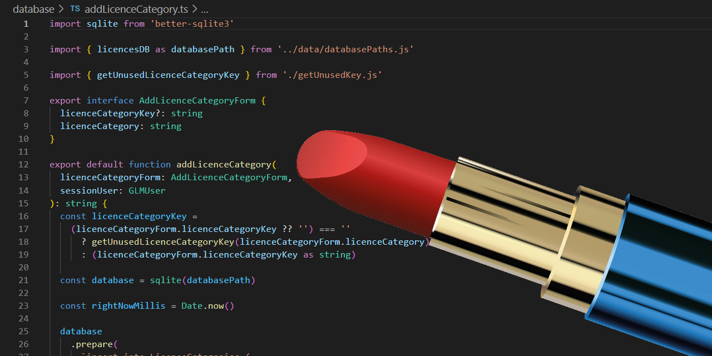

# prettier-config-cityssm

[](https://app.deepsource.com/gh/cityssm/prettier-config-cityssm/)
[](https://codeclimate.com/github/cityssm/prettier-config-cityssm/maintainability)



[Prettier](https://prettier.io/) configuration for the City of Sault Ste. Marie's projects.

## How to Use

```sh
npm install --save-dev prettier-config-cityssm
```

In the project's `prettier.config.js` file.

```javascript
export { default } from 'prettier-config-cityssm'
```

## Related Projects

**[eslint-config-cityssm](https://github.com/cityssm/eslint-config-cityssm)**<br />
ESLint rules used in the City of Sault Ste. Marie's TypeScript projects.
